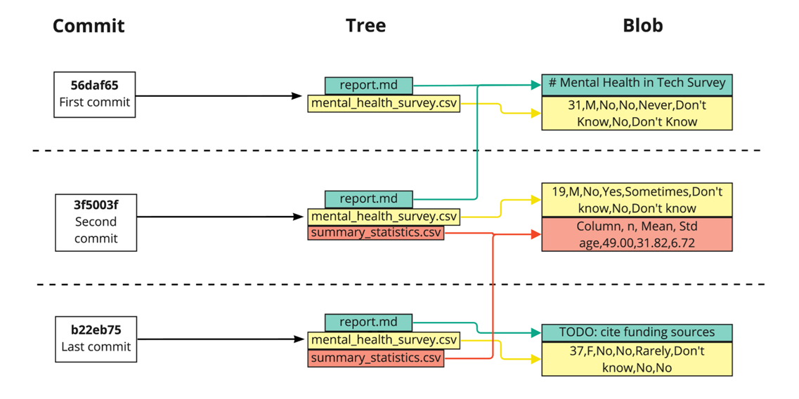

# I. Introduction to Git

### Definition 
One popular program for version control - Git <br>
Git is open source and scalable to easily track everything from small solo projects to complex collaborative efforts with large teams!

* Version of Git is installed
```bash
git --version
```
* See our location
```bash
pwd
```
* List down all files in directory
```bash
ls
```
* Move to another directory
```bash
cd another_directory
```
* Create a new repo
```bash
git init new_repo
```
* Convert existing dir into a Git repo
```bash
git init
```

### Git workflow
STAGING AREA --> COMMIT AREA <br>
* Add to staging
```bash
git add README.md
```
Add single file.
```bash
git add . 
```
Add all files. 
* Check the current status
```bash
git status
```
* Make a commit
```bash
git commit -m "Adding files"
```

### Version control
#### Commit Structure
Git commits have three parts:
1. Commit
* contains the metadata - author, log message, commit time
2. Tree
* tracks the names and locations of files and directories when that commit happened
* like a dictionary - mapping keys to files or directories
3. Blob
* Binary Large Object
* may contain data of any kind
* a compressed snapshot of a file's contents

Git hash: unique identifier .Hashes enable Git to share data efficiently between repos. If two files are the same, their hashes will be the same.
`b22eb75a82a68b9cOf1c45b9f5a9b7abe281683a`

* Shows commit from new to old
```bash
git log
```

#### Versions history
* Display the two most recent commits of a specific file
```bash
git log -2 current_file.sql
```
* Display by the date range
```bash
git log --since='Apr 2 2025' --until='Apr 11 2025'
```
* Show a particular commit
```bash
git show c25fa520
```

#### Compare versions
* Show difference between versions
```bash
git diff report.sql
```
* Compare latest commit ver vs staging ver
```bash
git diff --staged report.sql
```
* Compare two commit hashes
```bash
git diff 35af4a5 185a4h6
```
Show what change fomr 1st to 2nd hash.
* Use HEAD in compare
```bash
git diff HEAD~1 HEAD
```

#### Restore and revert files
1. Revert
Restoring a repo to the state prior to the previous commit
* Reinstates previous versions and makes a commit
* Restores all files updated in the given commit
```bash
git revert HEAD
```
* Avoid open the text editor
```bash
git revert --no-edit HEAD
```
* Revert without commit (bring files into staging)
```bash
git revert -n HEAD
```
* Revert a single file
```bash
git checkout 35af4a5 -- report.md
```
* Check the checkout
```bash
git status
```
2. Restore
* Restore a single file (unstage a single file)
```bash
git restore --staged summary.sql
```
* Restore all files
```bash
get restore --staged
```

### Branch
An independent line of development that splits off from the main codebase (usually the `main` or `master` branch).
* List all branches
```bash
git branch
```
record with `*` is noted for current branch

#### Create branch
* Switch between branches
```bash
git switch main
# or
git checkout main
```
* Create a new branch
```bash
git branch order
```
* Create and switch to it
```bash
git switch -c order
# or
git checkout -b order
```

#### Modify & Compare branches
* Compare two branches
```bash
git diff main order
```
* Rename a branch
```bash
git branch -m order purchase_order
```
Change the name of branch from 'order' to 'purchase_order'
* Delete a branch
```bash
git branch -d purchase_order
```
If you have not merged the branch to `main`
```bash
git branch -D purchase_order
```

#### Merge branch
Source and destination
* the last commits from each branch are called parent commits
* source -- the branch we want to merge from
* destination -- the branch we want to merge into a.k.a `main`
```bash
git merge order
```
#### Merge conflict
* Open a file
```bash
nano order
```

### Remotes
Remote repo - a repo stored in the cloud through an online repo hosting service such as GitHub.
* Clone a repo
```bash
git clone path-to-project-repo
```
* Clone a remote
```bash
git clone https://github.com/hieult/project
```
* List all remotes associated with the repo
```bash
git remote -v
```
* Add remote by a name
```bash
git remote add remote_name https://github.com/hieult/project
```
* Fetch from a remote
```bash
git fetch origin
```
- Fetch all remote branches
- Create new local branches if they only existed in the remote
- Doesn't merge the remote's contents into local repo
* Fetch only from the `origin` remote's `main` branch
```bash
git fetch origin main
```
* Merge origin remote's default branch - `main` into the local repo's current branch
```bash
git merge origin
```
* Simplifies process
```bash
git pull origin 
```
* Pull a certain branch
```bash
git pull origin dev_branch
```
* Push into `remote` from `local_branch`
```bash
git push remote local_branch
```
* Push changes into `origin` from local `main` branch
```bash
git push origin main
```
